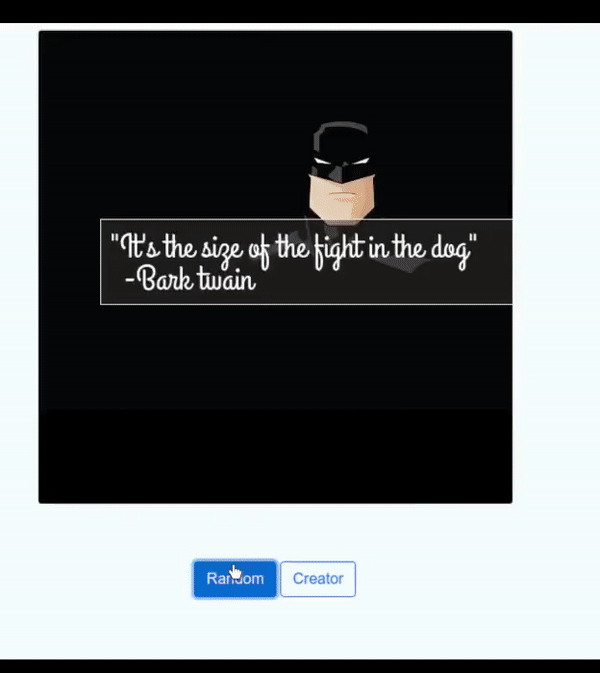
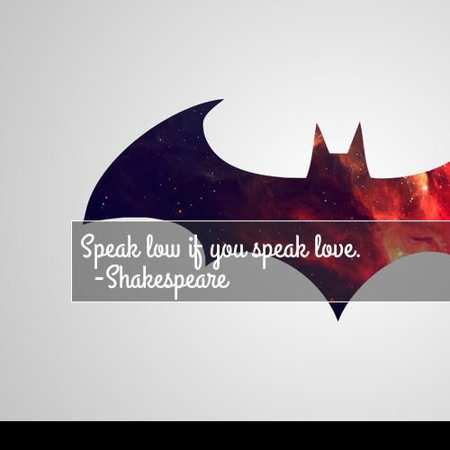
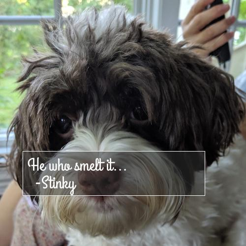
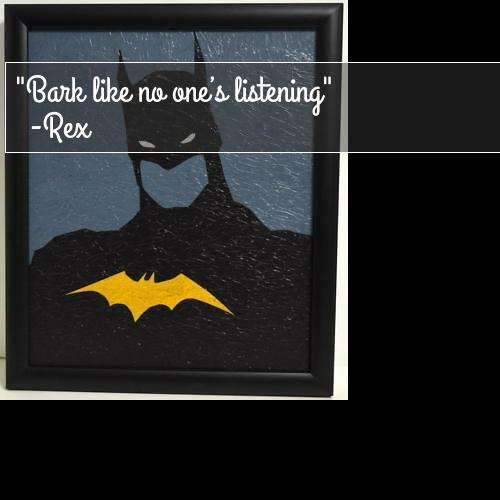

# Motivational Puppy Meme Generator

Check out the live version in heroku

https://memegeneratorpy.herokuapp.com/

## Udacity - Intermediate Python Nanodegree

The goal of this project is to build a "meme generator"—a multimedia application to dynamically generate memes, including an image with an overlaid quote. It’s not that simple though! Your content team spent countless hours writing quotes in a variety of filetypes. You could manually copy and paste these quotes into one standard format – but you’re going to over-engineer a solution to load quotes from each file to show off your fancy new Python skills. 



### Sample Memes








### Setting up project in your machine

* Clone this repository

```sh
git clone https://github.com/amitupreti/meme-generator-pynd
cd meme-generator-pynd
```

* Install the project dependencies in virtual environment

```sh
python3 -m venv env
source env/bin/activate
python3 -m pip install -r requirements.txt
```

## Understanding the project

The project consists of two applications

1. [The Command line app](#command-line-app)
2. [Flask App](#flask-app)

#### Command Line APP

   It lets user create their own personalized Memes.
   ##### Instructions for command line app
   * Navigate inside the project directory and activate the virtual environment
   ```sh
   cd meme-generator-pynd
   source env/bin/activate
   cd src
   ```
    
   *  Pass the Meme body, Author, Image path(local) as arguments
      If the arguments are not passed by users and random quote is selected.
      ``` sh
      python3 meme.py --body "Speak low if you speak love." --author "Shakespeare" --path "./pathtoyourimage"
      ```
      


#### Flask APP

   It provides users with a web interface where they can generate a random MEME or pass their own image_url, body and author to create they own MEME
   ##### Instructions for Flask app
   * Navigate inside the project directory and activate the virtual environment
   ```sh
   cd meme-generator-pynd
   source env/bin/activate
   cd src
   ```
    
   *  Export our app.py to the environment variable `FLASK_APP`
      ``` sh
       export FLASK_APP=app
      ```
   *  Run the Flask APP
      ```sh
       flask run
       ```
   
   
      
   

